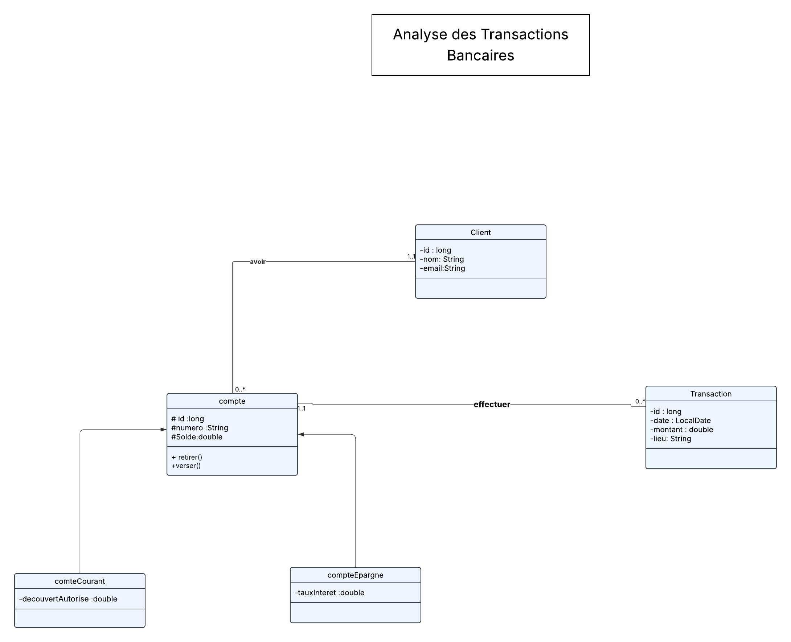

-----

# 🚀 Projet : Analyse des Transactions Bancaires et Détection des Anomalies

Ce projet est une application console développée en **Java 17** pour la **Banque Al Baraka**. Son objectif est de fournir un outil complet pour la **gestion des transactions**, le **calcul de statistiques**, et la **détection automatisée d'anomalies** financières, en respectant une architecture logicielle rigoureuse.

-----

## 💻 Technologies et Exigences Techniques

Ce projet est basé sur les technologies et concepts suivants :

| Catégorie | Technologie/Concept | Implémentation |
| :--- | :--- | :--- |
| **Langage** | **Java 17 (JDK)** | Utilisation des fonctionnalités modernes : `record`, `sealed classes`, `switch expressions`. |
| **Programmation** | **Fonctionnelle** | Usage intensif de l'**API Stream**, des **expressions Lambda**, et de `Optional` pour les agrégations (Top 5, Soldes Max/Min, Totaux). |
| **Persistance** | **JDBC** | Gestion directe des opérations CRUD. Stratégie de connexion optimisée pour éviter les erreurs de connexion fermée. |
| **Base de Données** | **PostgreSQL** | Schéma implémenté avec clés primaires/étrangères pour l'intégrité. |
| **Architecture** | **Architecture en 5 Couches** | Séparation claire des packages `entity`, `dao`, `service`, `ui`, et `util`. |

-----

## 🏗️ Structure de l'Application

L'architecture est construite sur cinq couches garantissant la modularité :

| Package | Rôle | Détails |
| :--- | :--- | :--- |
| **`entity`** | Modèle de Données | Contient les `record` (`Client`, `Transaction`) et la hiérarchie `sealed` de `Compte`. |
| **`dao`** | Accès aux Données (JDBC) | Implémente le CRUD pour chaque entité, gère le mapping Java/SQL. |
| **`service`** | Logique Métier | Contient les règles de gestion (Débit/Crédit, Virement) et les analyses complexes (`TransactionServiceImpl`, `RapportServiceImpl`). |
| **`ui`** | Interface Utilisateur | Point d'entrée (`MainApp`), gestion du menu console et de la saisie utilisateur. |
| **`util`** | Utilitaires | Gestion de la connexion (`DatabaseConnection`) et du formatage (`FormatUtils`). |

-----

## 📊 Fonctionnalités et Rapports Clés

Toutes les exigences du brief ont été couvertes et sont accessibles via le menu console :

### Menu [1] : Gestion Clients et Comptes

* **CRUD étendu** : Ajout, Consultation, **Modification** (Client/Compte) et **Suppression** d'entités.
* Consultation des **Soldes Maximum et Minimum** des comptes.

### Menu [2] : Opérations Bancaires

* Gestion des opérations de `VERSEMENT`, `RETRAIT` et `VIREMENT` (avec validation des plafonds).

### Menu [3] : Consultation des Transactions

* Filtrage avancé par **Montant Minimum**, **Date**, et **Lieu**.
* Calcul du **Volume Total des Transactions** pour un client spécifique.

### Menu [4] : Analyse et Rapports (Anomalies)

* **Rapports Statistique** : **Top 5 Clients** par solde et **Rapport Mensuel** (volume/nombre).
* **Détection des Anomalies** : Identification des **Comptes Inactifs**, des **Transactions Suspectes** (montant/lieu) et de la **Fréquence Excessive** d'opérations.
* **Alertes UI** : Affichage d'une alerte si le **Solde est Bas** lors de la consultation des comptes.

-----

## 🗃️ Configuration de la Base de Données

Le fichier de configuration de la base de données doit être placé à la racine du projet sous le nom **`db.properties`** :

```properties
db.url=jdbc:postgresql://localhost:5432/nom_de_votre_base
db.user=votre_utilisateur
db.password=votre_mot_de_passe
```

-----

## 🖼️ Diagramme de Classes UML


``

-----

## ▶️ Lancement de l'Application

### Prérequis

1.  **JDK 17** est installé.
2.  Le pilote **PostgreSQL JDBC JAR** est inclus dans le JAR exécutable.
3.  La base de données PostgreSQL est accessible et les tables sont créées.

### Exécution du JAR

L'application doit être lancée via le JAR exécutable généré par IntelliJ (Artifacts) :

```bash
# Placez-vous dans le répertoire contenant le fichier JAR (ex: out/artifacts/MonApp_jar)
java -jar Analyse-des-Transactions-Bancaires.jar
```

-----

**Développé par :** \[Hanane Ouabaha]
**Spécialité :** Java (YouCode 2ème Année)